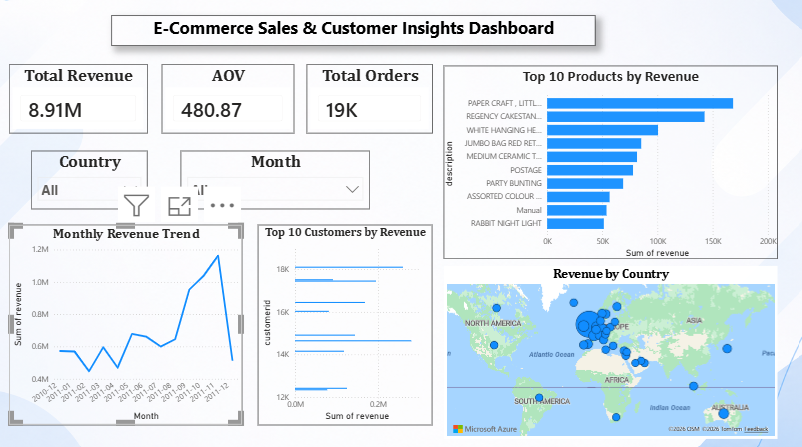

# 📊 E-Commerce Sales & Customer Insights Analysis

## 📌 Project Overview

This project demonstrates an end-to-end data analysis workflow using **PostgreSQL, SQL, Excel, and Power BI**. The objective was to transform raw e-commerce transaction data into meaningful business insights by performing data cleaning, SQL analysis, and building an interactive Power BI dashboard.

The dashboard enables stakeholders to monitor key business metrics, identify revenue trends, analyze customer purchasing behavior, and evaluate product performance to support data-driven decision-making.

---

## 🎯 Business Objectives

- Analyze overall sales performance
- Track monthly revenue trends
- Identify top-performing products
- Identify high-value customers
- Compare revenue across countries
- Build an interactive dashboard for business users

---

## 🛠️ Tools & Technologies

- **PostgreSQL** – Data storage and SQL analysis
- **SQL** – Data cleaning and business queries
- **Power BI** – Interactive dashboard development
- **Excel** – Data preparation and validation
- **Git & GitHub** – Version control and project portfolio

---

## 📂 Dataset

**Dataset:** Online Retail Dataset

The dataset contains transactional records from an online retail business, including:

- Invoice Number
- Product Description
- Quantity
- Unit Price
- Invoice Date
- Customer ID
- Country

---

## 🧹 Data Cleaning

The raw dataset was cleaned using SQL by:

- Removing records with missing Customer IDs
- Removing transactions with negative or zero quantities
- Removing transactions with zero unit prices
- Creating a cleaned dataset
- Creating a Revenue column (`Quantity × UnitPrice`)

---

## 📊 SQL Analysis

Business analysis was performed using SQL to answer key business questions.

### Revenue Analysis

- Monthly Revenue Trend
- Total Revenue
- Average Order Value (AOV)
- Total Orders

### Product Analysis

- Top 10 Products by Revenue

### Customer Analysis

- Top 10 Customers by Revenue

### Geographic Analysis

- Revenue by Country

### SQL Concepts Used

- SELECT
- WHERE
- GROUP BY
- ORDER BY
- COUNT()
- SUM()
- DISTINCTCOUNT logic
- DATE_TRUNC()
- ALTER TABLE
- UPDATE
- Window Function (LAG)

---

# 📈 Dashboard Features

The Power BI dashboard includes:

✅ Total Revenue KPI

✅ Total Orders KPI

✅ Average Order Value (AOV)

✅ Monthly Revenue Trend

✅ Top 10 Products by Revenue

✅ Top 10 Customers by Revenue

✅ Revenue by Country (Map)

✅ Interactive Country Filter

✅ Interactive Month Filter

---

## 📊 Key Insights

- Revenue exceeded **8.9M** across the analyzed transactions.
- A small number of customers generated a significant share of total revenue.
- Certain products consistently outperformed others in revenue generation.
- Revenue varied across countries, highlighting key geographic markets.
- Monthly revenue trends revealed periods of stronger business performance.

---
## 📷 Dashboard Preview


---

## 📁 Project Structure

```
ecommerce-sales-customer-insights-analysis
│
├── dashboard.png
├── Ecommerce Dashboard.pbix
├── ecommerce_analysis.sql
├── retail_cleaned.csv
└── README.md
```

---

## 🚀 Skills Demonstrated

- SQL Data Cleaning
- SQL Aggregations
- Business Analysis
- KPI Development
- Dashboard Design
- Data Visualization
- Geographic Analysis
- Git Version Control
- GitHub Project Management

---

## 👩‍💻 Author

**Marmika Pimparkar**

Aspiring Data Analyst passionate about transforming raw data into actionable business insights using SQL, Power BI, and Excel.

GitHub:
https://github.com/marmikapimparkar

---

⭐ If you found this project useful, feel free to star the repository.
